## Unity 6 Render Graph入門～Render Graphの仕組みと簡単なポストプロセス実装～

## 1. Render Graphとは？
`Render Graph`はUnity 6から導入されたシステムで`Scriptable Render Pipeline`で動作します。このシステムを利用することで、ユーザー独自のスクリプタブルレンダリングパスを追加でき、より柔軟にレンダリングパイプラインをカスタマイズできます。

Render GraphはHDRPには以前から存在しており、Unity 6からURPでも利用できるようになりました。

### Render Graph以前
さて、Scriptable Render Pipeline自体はUnity 6以前から存在しており、ユーザー独自のレンダリングパスを追加することは元々できていました。<br/>
つまり、レンダリングの自由なカスタマイズは以前から行えていたことになります。</br>
なお、Unity 6.3までは`Compatible Mode(互換性モード)`が用意されており、このモードがオンになっているとRender Graph以前のカスタムレンダリングパスの処理を引き続き利用することができます。</br>
しかし、6.4からはCompatible Modeが完全に削除されて、Render Graphに完全に移行することが発表されています。</br>
これは破壊的な変更で、既存のカスタムレンダリングが完全に動作しなくなることを意味しています。

では、なぜUnityは破壊的な変更を推進するのでしょうか。これには現在のモバイルGPUアーキテクチャと密接にかかわる理由があります。
次の節では現在のGPUのアーキテクチャを紹介し、Render Graphを理解するための下地を学びます。

## 2. タイルベースレンダリング

現代のGPUは演算速度とメモリの読み書き速度の差がどんどん大きくなり、メモリアクセスが大きなボトルネックになっています。PCのディスクリートGPUではグラフィックス専用のメモリ帯域の広いグラフィックスメモリを搭載することでこの問題を軽減できます。しかし、多くのモバイルGPUでは発熱量、消費電力の問題で専用のグラフィックスメモリを持たず、CPUとGPUでメモリを共有しています。そのため、メモリの読み書き速度はPC以上に大きな問題となります。そこで、この問題を解決するためにTBRアーキテクチャのGPUが生まれました。

TBRアーキテクチャのGPUではタイルメモリという小さなキャッシュメモリをシェーダーコアに搭載し、そのメモリに対して書き込みと読み込みを行います。このタイルメモリは物理的距離もGPUコアから近く、メモリ帯域の問題を軽減できるため、TBRアーキテクチャのGPUが主流になってきました。
次の図はARM Mali-G71 GPUの[公式資料](https://community.arm.com/cfs-file/__key/telligent-evolution-components-attachments/01-2066-00-00-00-00-71-76/HotChips-Presentation-Jem-Davies.pdf)から抜粋したシェーダーコアの設計図です。シェーダーコアにタイルメモリが接続されていることが分かります。

<p align="center">
  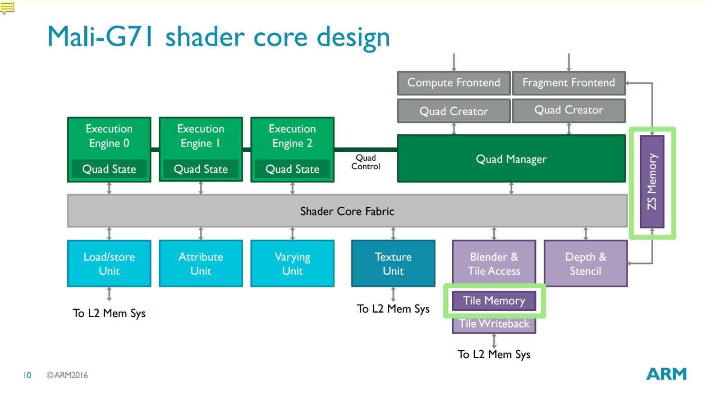<br>
  <font color="grey">ARM Mali-G71 シェーダーコア設計図</font>
</p>


TBRアーキテクチャのGPUでは次の図のように画面をタイルで分割し、シェーダーコアに接続されたタイルメモリに対してレンダリングします。

<p align="center">
  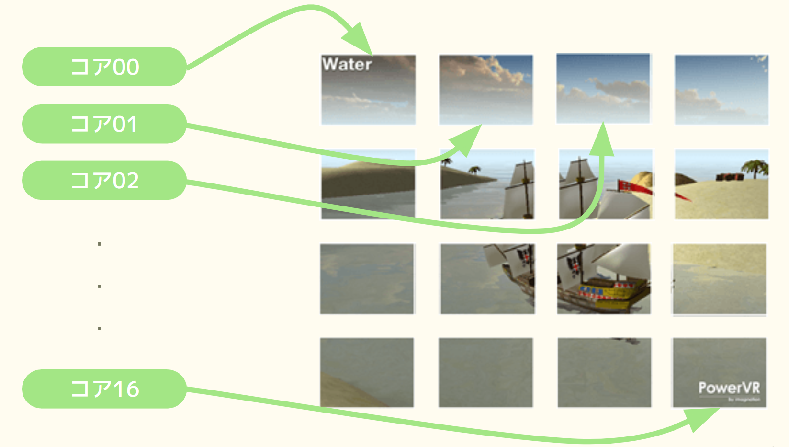<br>
  <font color="grey">タイルベースレンダリングのイメージ図-1</font>
</p>

### レンダーバッファのロード/ストア
さて、モバイルのGPUではタイルメモリへのリードライトを間にはさむことによって、グラフィックスメモリへのアクセス回数を減らすことができ高速化を行えることがわかりました。しかし、最終的にはタイルメモリの内容をメモリにストアする操作が必要になるため、この回数が多くなるとやはりネックになってきます。

例えばG-Bufferを作成してライティングを行うディファードレンダリングを考えてみましょう。ディファードレンダリングの流れは次のようになります。

1. G-Bufferの作成（アルベド、法線、メタリック/スムースマップへの書き込み）
2. ディファードライティング（1で作成したG-Bufferをテクスチャとして利用する）

この処理をさらに詳細に見ていくと次のようになります。

1. G-Bufferの作成(アルベド、法線、メタリックの情報をタイルメモリに書き込んでいく)
2. アルベド、法線、メタリックの情報をメインメモリにストアする
3. 2でストアされたG-Bufferをサンプリングしてディファードライティングを実行

<p align="center">
  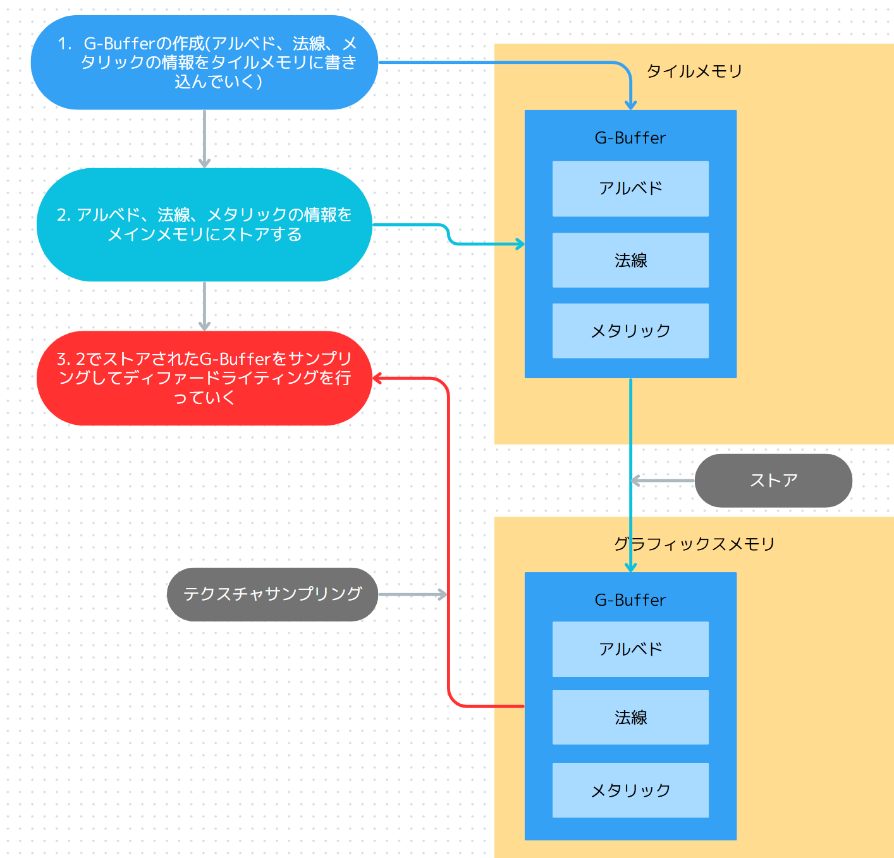<br>
</p>

このように、1で作成されたG-Bufferを3でテクスチャとして利用するためには一度メインメモリにストアする必要があります。しかし、ここで一つ疑問が生まれます。</br>
3のG-Bufferのサンプリングをテクスチャからではなく、直接タイルメモリから読み込むことはできないのでしょうか。</br>
もしタイルメモリからの読み込みができれば次のような処理になりメインメモリへのストアを削減できます。

1. G-Bufferの作成(アルベド、法線、メタリックの情報をタイルメモリに書き出し)
2. タイルメモリからG-Bufferをサンプリングしてディファードライティングを実行
<p align="center">
  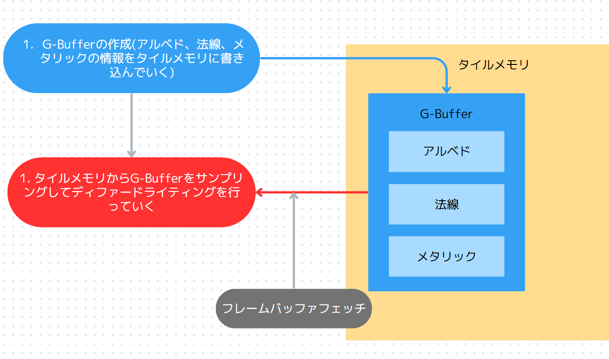<br>
</p>

この機能はフレームバッファフェッチと呼ばれ、Unityでも利用できます。

## 3. GPUの並列動作

GPUは超並列演算機と呼ばれるほど、並列演算が得意です。GPUの演算性能を上げるためには、シェーダーコードのような下流の部分でのコードの書き方も重要になってくるのですが、もっと上流のレンダリングパイプラインの設計時のリソース依存性の考慮も重要になってきます。ここではリソース依存性に焦点をあててみていきます。

### リソース依存性
ゲームの絵を完成させるまでの1フレームのリアルタイムの工程を`レンダリングパイプライン`といいます。また、この`レンダリングパイプライン`を構築している一つ一つの処理を`レンダリングパス`と呼びます。

<p align="center">
  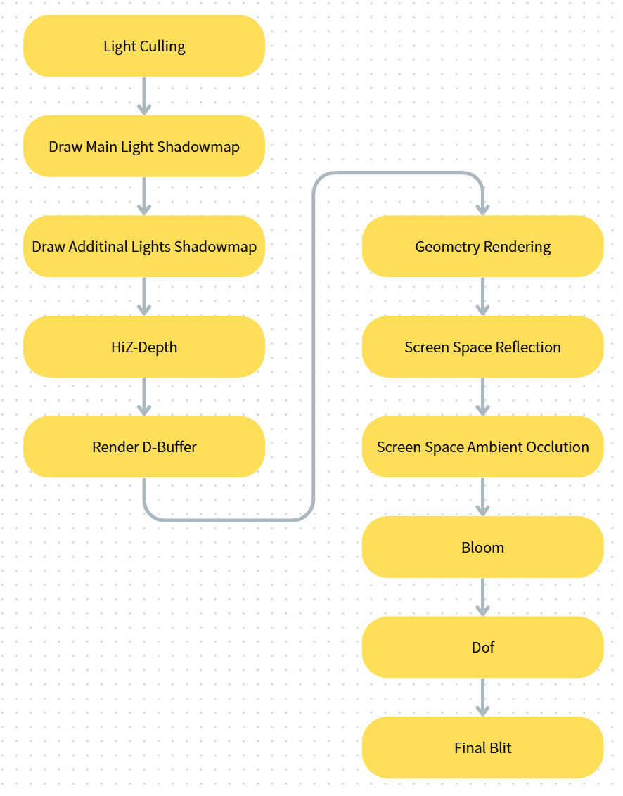<br>
  <font color="grey">レンダリングパイプライン</font>
</p>

`レンダリングパス`は内部でさらに細かいパスに分割されることがあります。

例えば、先ほどのGeometry Renderingパスでは次のようなパスの組み合わせでレンダリングパスが構築されています。

1. 深度プリパスで深度バッファを作成
2. G-Bufferに不透明オブジェクトを描画
   1. 深度バッファを使用
3. 不透明バッファにディファードライティング
   1. G-Bufferと深度バッファを使用
4. 半透明バッファに半透明オブジェクトを描画
   1. 深度バッファを使用
5. 不透明バッファと半透明バッファを合成してフレームバッファに描画

ここで、Geometry Renderingパスの詳細を知る必要はありません。重要なのはリソース依存性です。このようなレンダリングパスが構築されているときに、リソース依存性をGPUに伝えられれば、GPUは処理を並列に実行できます。</br>

この例では、4番のパスは2番と3番のパスの描画結果を利用していないので、2、3を実行しているときに4を並列に処理できます。

<p align="center">
  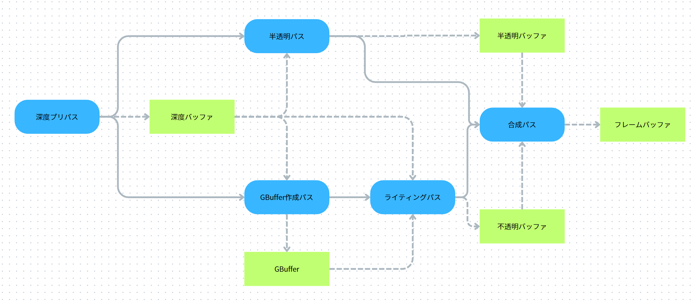<br>
  <font color="grey">レンダリングパスの並列化</font>
</p>

このようなグラフのことを`有向非巡回グラフ（Directed Acyclic Graph、DAG）`と呼びます。


### VulkanのRenderPass/SubPass
リソース依存性をGPUに伝えることで、GPUの並列動作性を高められることが分かりました。では、リソース依存性をGPUに伝えるにはどうすればいいのでしょうか？
現在のモバイルGPUで広く利用可能な`Vulkan`や`Metal`などのグラフィックスAPIには`RenderPass/SubPass`という仕組みがあります。<br/>
この仕組みを利用することで、リソース依存性を定義できてGPUに教えることができます。

RenderPassはシャドウマップ描画パスや不透明描画パスなどをAPIレベルで定義するためのものです。またRenderPassには一つ以上のSubPassが含まれます。<br/>
たとえば先ほどのGeometry RenderingをRenderPass/Subpassで表すと次のようになります。

- Geometry Renderingパス(RenderPass)
  - 深度プリパス(Subpass)
  - 不透明オブジェクトをG-Bufferに描画(Subpass)
  - 不透明バッファにディファードライティング(Subpass)
  - 半透明バッファに半透明オブジェクトを描画(Subpass)
  - 不透明バッファと半透明バッファを合成してフレームバッファに描画(Subpass)

また、SubPassは入力アタッチメントと出力アタッチメントを定義できます。<br/>例えば、先ほどの例であれば次のようにリソースを定義できます。
- Geometry Renderingパス(RenderPass)
  - 深度プリパス(Subpass)
    - 出力アタッチメント: 深度バッファ
  - 不透明オブジェクトをG-Bufferに描画(Subpass)
    - 入力アタッチメント: 深度バッファ
    - 出力アタッチメント: G-Buffer
  - 不透明バッファにディファードライティング(Subpass)
    - 入力アタッチメント: G-Buffer
    - 出力アタッチメント: 不透明バッファ
  - 半透明バッファに半透明オブジェクトを描画(Subpass)
    - 入力アタッチメント: 深度バッファ
    - 出力アタッチメント: 半透明バッファ
  - 不透明バッファと半透明バッファを合成してフレームバッファに描画(Subpass)
    - 入力アタッチメント: 不透明バッファ、半透明バッファ
    - 出力アタッチメント: フレームバッファ

入力アタッチメント/出力アタッチメントを定義することによって、SubPass間のリソースの依存性をGPUに教えることができます。そしてこの依存性を工夫することでレンダリングパスの並列実行も可能になります。

### メモリーレス
先ほどの`Geometry Renderingパス`を見てみると、深度バッファ、G-Buffer、不透明バッファ、半透明バッファは計算用の中間バッファで、タイルメモリ上のリソースです。<br/>
もし、これらのリソースをテクスチャとして後続のパスで利用しない場合、メインメモリにストアせずに破棄できます。Vulkan/Metalではリソースにメモリーレスモードを指定でき、メモリーレスが指定されたリソースはストアされずに破棄されます。このモードを利用することでメモリ使用量を削減できます。

## 4. Unityとの関連
Unityも内部的にはVulkan/MetalなどのAPIを利用しています。そのため、`RenderPass/Subpass`を効果的に利用することでGPUの並列動作性を高めることが可能です。しかしながら、Render Graph以前のScriptable Render Pipelineでは典型的なコードを書いた場合は、RenderPassとSubpassが必ず1対1になってしまいます。

以前のシステムで実装される典型的なパスは、独立したパスになってしまい、パス間のリソース依存性を定義する方法がありません。そのため、RenderPassの中に複数Subpassがあるようなパスを構築することが難しかったです。<br/>
（※VulkanのRenderPassとほぼほぼ同等のScriptableRenderContext.BeginRenderPass/BeginSubPassを利用することで同等のことを実現することはできます）<br/>
また、リソース依存性が定義されていないので、メモリーレスモードを使用したい場合は、プログラマが注意を払ってメモリーレス対応を行う必要があります。

この問題がRender Graphでは解消されています。Render Graphを利用してRenderPassを追加する場合は、次のような情報をシステムに渡します。

- 出力アタッチメント
- 入力アタッチメント
- 使用するテクスチャ
- etc

この情報を元にRender Graphは`Native pass`（VulkanのRenderPassに相当）を構築します。そして、可能であればサブパスも構築してくれます。Render Graphではこれを`パスをマージ`すると呼びます。<br/>
パスがマージされる主な条件は次のようなものになります。

- 出力アタッチメントの解像度が同じ
- 出力アタッチメントをテクスチャとして利用していない
  - ※入力アタッチメントとテクスチャは別物

この条件を満たすときにパスがマージされ、複数のサブパスが一つのレンダーパスに含まれます。また、メモリーレス化もRender Graphが行ってくれます。これは後続するパスで中間リソースが利用されていない場合、自動的にメモリーレス化してくれます。


## 【ハンズオン演習】シーンをモノクロ化した画像とセピア化した画像を合成する
では、簡単なポストプロセスを実装していきましょう。`Assets/Demo_00/Demo_00.unity`シーンを開いてください。
このシーンを開くと次の画像のようなステージが表示されます。<br/>
今回は、このシーンに深度情報を元にモノクロ化とセピア化された画像を合成する処理を実装していきます。</br>
なお、この演習の完成版として`MonoChromeSepeaPass.cs.after`、`Monochrome-Sepia.shader.after`が用意されていますので、問題が起きたときはそちらのコードを参照してみてください。

<p align="center">
  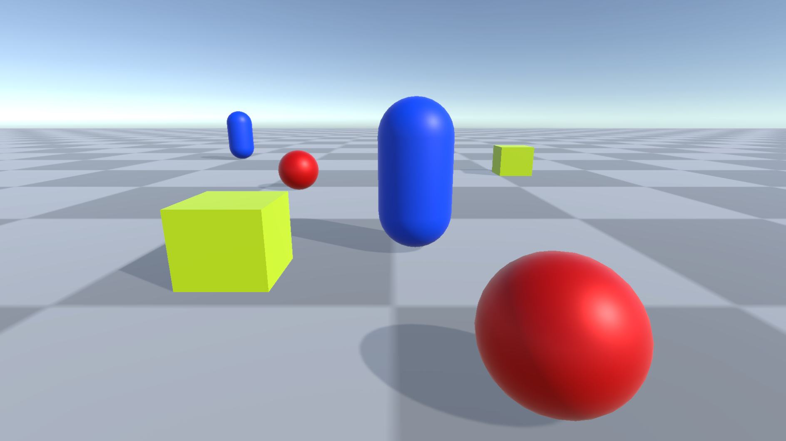<br>
</p>

### step-1 モノクロ画像の描きこみ先のテクスチャを作成する
最初は、C#側のコードから実装していきます。`Assets/Demo_00/Feature/MonoChromeSepeaPass.cs`を開いてください。

まずはモノクロ画像の描き込み先となるテクスチャを作成します。下記のコードを該当するコメントの箇所に入力してください。
このテクスチャは計算用の一時テクスチャで、このパス以降で利用しないので、メモリーレスモードを指定している点に注目してください。
```cs
// step-1 モノクロ画像の描きこみ先のテクスチャを作成する
var monochromeTextureDesc = renderGraph.GetTextureDesc(universalResourceData.cameraColor);
// メモリーレスを指定
monochromeTextureDesc.memoryless = RenderTextureMemoryless.Color;
monochromeTextureDesc.name = "Monochrome Texture";
var monochromeTextureHandle = renderGraph.CreateTexture(monochromeTextureDesc);
```

### step-2 セピア画像の描きこみ先のテクスチャを作成する

続いて、セピア画像の描き込み先となるテクスチャを作成します。<br/>
なお、モノクロ化とセピア化の画像はRender Graphの管理下のテクスチャとなっているため、不要になるとRender Graphが適切なタイミングでテクスチャを破棄してくれます。そのため、アプリケーション側がライフサイクルを管理する必要はありません。<br/>

(※ アプリケーション側でテクスチャのライフサイクルを管理したい場合はRTHandleなどを利用して、アプリ側で作成したテクスチャをRender GraphにImportする必要があります。)

では次のコードを入力してください。
```cs
var sepiaTextureDesc = renderGraph.GetTextureDesc(universalResourceData.cameraColor);
// メモリーレスを指定
sepiaTextureDesc.memoryless = RenderTextureMemoryless.Color;
sepiaTextureDesc.name = "Sepia Texture";
var sepiaTextureHandle = renderGraph.CreateTexture(sepiaTextureDesc);
```

### step-3 モノクロ化のパスを作成する
リソースの準備ができたので、各種パスをRender Graphに追加していきます。まずはモノクロ化のパスです。<br/>
今回追加するのは最も基本となる`Raster Render Pass`です。<br/>
RenderGraph::AddRasterRenderPassが返してくる`IRasterRenderGraphBuilder`を使って、出力先、使用するテクスチャなどをRenderGraphに設定します。これらを設定することによって、リソース依存性などを考慮して最適化されたNative Render Passが構築されます。

IRasterRenderGraphBuilder::SetRenderFuncで指定した処理が、Native Render Passから呼び出される描画コマンドを積んでいく処理です。

```cs
// step-3 モノクロ化のパスを作成する
using(var builder = renderGraph.AddRasterRenderPass<PassData>("Monochrome Pass", out var passData))
{
    // 出力先としてmonochromeTextureHandleを指定する。
    builder.SetRenderAttachment(monochromeTextureHandle, 0);
    // カメラカラーをテクスチャとして使用申請する
    builder.UseTexture(universalResourceData.cameraColor);
    
    passData.BlitMaterial = _material;
    passData.SourceTexture = cameraColor;
    // ネイティブパス構築時に実際に呼び出されるメソッドを指定する
    builder.SetRenderFunc(static (PassData passData, RasterGraphContext context) =>
    {
        var cmd = context.cmd;
        // ソーステクスチャにカメラカラーを指定してBlitを行う
        Blitter.BlitTexture(cmd,  passData.SourceTexture, Vector2.one, passData.BlitMaterial, 0);
    });
}
```

### step-4 セピア化のパスを作成する
続いて、セピア化のパスを追加します。やっていることはモノクロ化とほぼ同じです。
次のコードを入力してください。
```cs
// step-4 セピア化のパスを作成する
using(var builder = renderGraph.AddRasterRenderPass<PassData>("Sepia Pass", out var passData))
{
    builder.SetRenderAttachment(sepiaTextureHandle, 0);
    // カメラカラーをテクスチャとして使用申請する
    builder.UseTexture(universalResourceData.cameraColor);
    passData.BlitMaterial = _material;
    passData.SourceTexture = cameraColor;
    builder.SetRenderFunc(static (PassData passData, RasterGraphContext context) =>
    {
        var cmd = context.cmd;
        // ソーステクスチャにカメラカラーを指定してBlitを行う
        Blitter.BlitTexture(cmd,  passData.SourceTexture, Vector2.one, passData.BlitMaterial, 1);
    });
}
```

### step-5 最終合成のパスを作成する
C#側の最後の処理の最終合成パスを作成していきます。
`IRasterRenderGraphBuilder::SetInputAttachment`を利用して、`monochromeTextureHandle`と`sepiaTextureHandle`を指定している点に注目してください。これはこれらのテクスチャをタイルメモリからロードするための指定です。

```cs
// step-5 最終合成のパスを作成する
using (var builder =
        renderGraph.AddRasterRenderPass<PassData>("Combine Pass", out var passData))
{
    builder.SetRenderAttachment(universalResourceData.cameraColor, 0);
    builder.SetInputAttachment(monochromeTextureHandle, 0);
    builder.SetInputAttachment(sepiaTextureHandle, 1);
    builder.UseTexture(universalResourceData.cameraDepth);
    passData.BlitMaterial = _material;  
    builder.SetRenderFunc(static (PassData passData, RasterGraphContext context) =>
    {
        var cmd = context.cmd;
        // ソーステクスチャにカメラカラーを指定してBlitを行う
        Blitter.BlitTexture(cmd, Vector2.one, passData.BlitMaterial, 2);
    });
}
```

### step-6 モノクロ化のフラグメントシェーダーの実装
ここからは各種シェーダーの実装をしていきましょう。`Assets/Demo_00/Monochrome-Sepia.shader`を開いてください。<br/>
まずはモノクロ化のフラグメントシェーダーを実装してきます。次のコードを該当するコメントの箇所に入力してください。
```cpp
// step-6 モノクロ化のフラグメントシェーダーの実装
half4 color = SAMPLE_TEXTURE2D_X(_BlitTexture, sampler_LinearClamp, input.texcoord);
color.xyz = dot(color.rgb, half3(0.299, 0.587, 0.114));
return color;
```

### step-7 セピア化のフラグメントシェーダーの実装
続いて、セピア化のフラグメントシェーダーを実装します。次のコードを該当するコメントの箇所に入力してください。
```cpp
half4 color = SAMPLE_TEXTURE2D_X(_BlitTexture, sampler_LinearClamp, input.texcoord);
half3 sepia = half3(0.393, 0.769, 0.189);
half3 sepia2 = half3(0.349, 0.686, 0.168);
half3 sepia3 = half3(0.272, 0.534, 0.131);
color.r = dot(color.rgb, sepia);
color.g = dot(color.rgb, sepia2); 
color.b = dot(color.rgb, sepia3);
return color;
```

### step-8 利用するフレームバッファメモリの定義（SetInputAttachmentに対応する）
ここからは最終合成のシェーダーです。まずは、SetInputAttachmentに指定されたタイルメモリにアクセスするための宣言を追加します。
```cpp
// step-8 利用するフレームバッファメモリの定義（SetInputAttachmentに対応する）
FRAMEBUFFER_INPUT_HALF(0);  // モノクロバッファはタイルメモリから読み込む
FRAMEBUFFER_INPUT_HALF(1);  // セピアバッファはタイルメモリから読み込む
```

### step-9 深度テクスチャの定義
最終合成では、カメラからの深度値に応じてモノクロ画像とセピア画像を合成するので、深度テクスチャも定義します。
深度テクスチャは_CameraDepthTextureという名前でURP内部でグローバルテクスチャ化されているため、それをそのまま利用します。
```cpp
// step-9 深度テクスチャの定義
TEXTURE2D_X_FLOAT(_CameraDepthTexture);
```

### step-10 合成の処理を実装する。
では、最後に合成のフラグメントシェーダーを実装していきます。
次のコードを入力してください。

```cpp
// タイルメモリからモノクロとセピアの色を取得する。
half4 monochromeColor = LOAD_FRAMEBUFFER_INPUT(0, input.positionCS.xy);
half4 sepiaColor = LOAD_FRAMEBUFFER_INPUT(1, input.positionCS.xy);

// シーンの深度値を取得する。
float depth = SAMPLE_TEXTURE2D_X(_CameraDepthTexture, sampler_LinearClamp, input.texcoord).r;

// _CameraDepthTextureは非線形な深度値なので線形な値に変換する。
float linearDepth = LinearEyeDepth(depth, _ZBufferParams);
// 深度値が20mより遠い場合はモノクロ化、近い場合はセピア化を行ためのブレンド値を計算する。
half blend = saturate(linearDepth / 20.0);
// ブレンドして出力
return lerp(sepiaColor, monochromeColor, blend);
```
これらが正しく実装できていると次の画像のように、カメラの手前はセピア調、奥に行くほどモノクロ化されるポストプロセスがかかります。

<p align="center">
  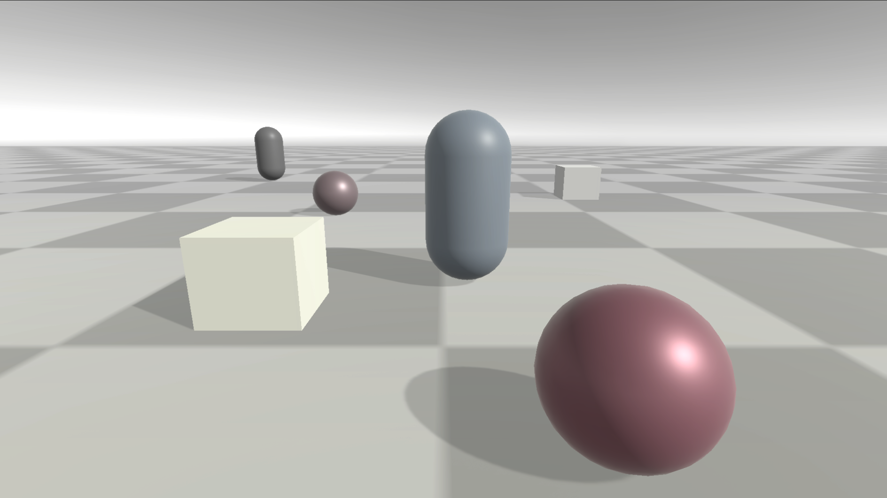<br>
</p>

### パスがマージされていることを確認する
では、これらのパスがマージされているか確認してみましょう。今回は`Frame Debugger`と`Render Graph Viewer`を使って確認してみます。
#### Frame Debuggerで確認
Frame Debuggerで確認すると、次のように`(RP 4:0)Monochrome Pass`、`(RP 4:1)Sepia Pass`、`(RP 4:2)Combine Pass`となっていて各種処理が`RP 4`にまとめられていることが分かります。これがサブパス化されている状態です。

<p align="center">
  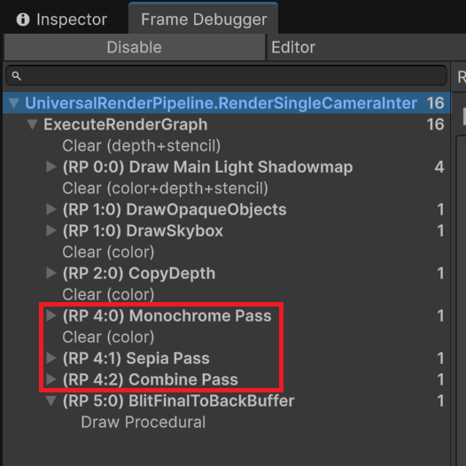<br>
</p>

#### Render Graph Viewerで確認
サブパス化（正確にはパスのマージ）はRender Graph Viewerでも確認できます。次の画像のように、各種パスにマージされていることを示す表示がされています。

<p align="center">
  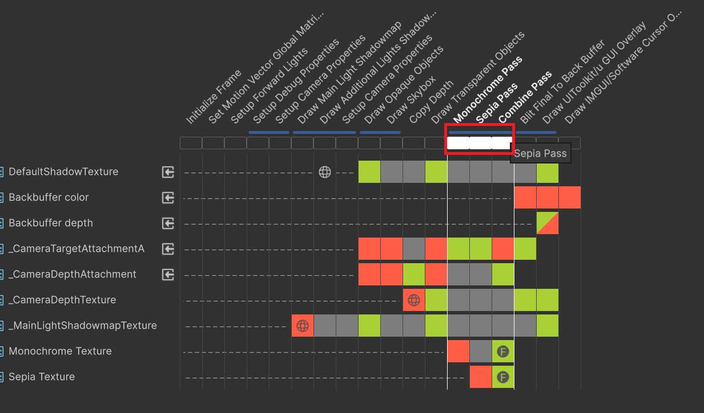<br>
</p>

### 入力アタッチメントとテクスチャは別物
さきほどの演習の画像合成のパスで、モノクロ化した画像とセピア化した画像を利用しました。これだけだと、入力アタッチメントで行える処理は、モノクロ化したテクスチャとセピア化したテクスチャをサンプリングど同等だと思われるかもしれませんが、入力アタッチメントで行える処理はフレームバッファフェッチと呼ばれるもので、テクスチャサンプリングと比べると次のような制約があります。

- 処理しているフラグメントと同じ場所しかロードできない
- 出力アタッチメントと解像度が同じである必要がある

では、次の演習で`処理しているフラグメントと同じ場所しかロードできない`の制約によって、入力アタッチメントが使用できないケースを見ていきましょう。

## 【ハンズオン演習】合成した画像にノイズをかける
では、先ほどの演習プログラムにノイズ加工を加える演習を行いましょう。先ほどの処理が一部実装されている`Assets/Demo_01/Demo_01.unity`を開いてください。</br>

なお、この演習の完成版として`MonoChromeSepeaPassNoise.cs.after`、`Monochrome-Sepia-Noise.shader.after`が用意されています。


### step-1 モノクロ化とセピア化の合成のパスを作成する
まずはC#側からです。`Assets/Demo_01/Feature/MonoChromeSepeaNoisePass.cs`を開いてください。<br/>
今回はモノクロ化とセピア化が最終結果ではないので、合成した画像を出力するためのテクスチャを作成し、そのテクスチャに合成処理を実行します。なお、このテクスチャは後のノイズ加工のパスでテクスチャとして利用するためメモリーレスモードの指定を行っていない点に注意してください。<br/>

では、次のコードを入力してください。
```cs
// step-1 モノクロ化とセピア化の合成のパスを作成する
// まずは合成結果を描き込むテクスチャを作成する
var combineTextureDesc = renderGraph.GetTextureDesc(universalResourceData.cameraColor);
combineTextureDesc.name = "Combine Texture";
var combineTextureHandle = renderGraph.CreateTexture(combineTextureDesc);

// モノクロ化とセピア化の合成のパスを作成する
using (var builder =
        renderGraph.AddRasterRenderPass<PassData>("Combine Pass", out var passData))
{
    builder.SetRenderAttachment(combineTextureHandle, 0);
    builder.SetInputAttachment(monochromeTextureHandle, 0);
    builder.SetInputAttachment(sepiaTextureHandle, 1);
    builder.UseTexture(universalResourceData.cameraDepth);
    passData.BlitMaterial = _material;  
    builder.SetRenderFunc(static (PassData passData, RasterGraphContext context) =>
    {
        var cmd = context.cmd;
        // ソーステクスチャにカメラカラーを指定してBlitを行う
        Blitter.BlitTexture(cmd, Vector2.one, passData.BlitMaterial, 2);
    });
}
```

### step-2 合成結果にノイズをかけるパスを追加する
続いて、合成結果にノイズをかけるパスをRender Graphに追加します。ここでの注目点は`combineTextureHandle`をUseTextureとして利用申請している点です。これは、ノイズ加工のシェーダーで`combineTextureHandle`をオフセットサンプリングするため、タイルメモリからのロードが行えないからです。

```cs
// step-2 合成結果にノイズをかけるパスを追加する
using (var builder =
        renderGraph.AddRasterRenderPass<PassData>("Noise Pass", out var passData))
{
    builder.SetRenderAttachment(universalResourceData.cameraColor, 0);
    // combineTextureHandleはオフセットサンプリングを行うため、タイルメモリからのロードができない。そのためテクスチャとして使用申請する
    builder.UseTexture(combineTextureHandle);
    passData.BlitMaterial = _material;
    passData.SourceTexture = combineTextureHandle;
    builder.SetRenderFunc(static (PassData passData, RasterGraphContext context) =>
    {
        var cmd = context.cmd;
        // ソーステクスチャにカメラカラーを指定してBlitを行う
        Blitter.BlitTexture(cmd,  passData.SourceTexture, Vector2.one, passData.BlitMaterial, 3);
    });
}
```

### step-3 ノイズ加工を行う
では、最後にノイズ加工のフラグメントシェーダーを実装します。`Assets/Demo_01/Monochrome-Sepia-Noise.shader`を開いて次のプログラムを入力してください。

```cpp
// step-3 ノイズ加工を行う
// 時間に基づいてノイズを変化させる
float2 noise = InterleavedGradientNoise(input.texcoord * _BlitTexture_TexelSize.zw, _Time.y * 100);

// ノイズを使ってUVをゆがませる
float2 distortedUV = input.texcoord + noise * 0.02;

// ゆがませたUVでテクスチャをサンプリング。
// ロードする位置がフラグメントの位置と違うためフレームバッファフェッチは使えない。
half4 color = SAMPLE_TEXTURE2D_X(_BlitTexture, sampler_LinearClamp, distortedUV);
return color;
```
正しく実装できていると次の画像のようにノイズ加工のポストプロセスがかかります。

<p align="center">
  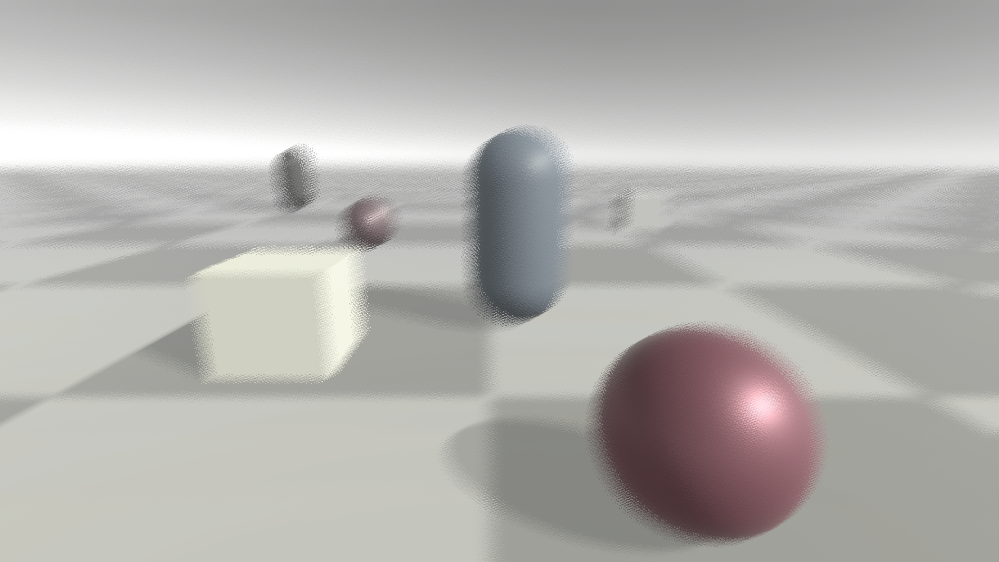<br>
</p>

### パスのマージ状況を確認する
今回の処理は、ノイズのパスで`combineTextureHandle`をテクスチャとして利用しているため、次の画像のようにサブパス化できず、単独のパスになっています。

<p align="center">
  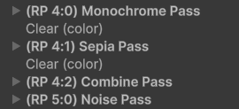<br>
</p>


## 4. 【課題】Deferred Renderingを実装する
最後に、モバイルのタイルメモリの特性を生かした、シンプルな`Deferred Rendering`を実装する二つの課題にチャレンジしてください。

1. `Assets/Demo_02`の中の下記のコメントを参考にランバート拡散反射を行うTBDRを実装する。なお、この課題は実装例となる`TileBasedDeferredRenderingPass.cs.after`と`DeferredLighting.shader.after`を参考に実装しても構わない
   1. step-1 ディファードライティングを行う
   2. step-2 フレームバッファ入力を宣言する
   3. step-3 タイルメモリからアルベドと法線をロードする
   4. step-4 ハーフランバート拡散反射を計算する
2. 1で実装したTBDRに追加で一つ以上の情報をG-Bufferに埋め込んで、ディファードライティングを拡張する（例：スペキュラ反射を実装するなど）


## 5. 参考資料

[『学園アイドルマスター』モバイルでも“ライティングと反射”を描き切る！ライブの臨場感と迫力を追求したレンダリングパイプライン【CEDEC2024】](https://gamemakers.jp/article/2025_01_29_90729/)

[モバイルで爆速なDeferred Renderingを行う方法](https://cedil.cesa.or.jp/cedil_sessions/view/2457)

[Unity6からRenderGraphを使いこなそう ー 基本機能編](https://blog.sge-coretech.com/entry/2024/06/04/171757)
[Unity6からRenderGraphを使いこなそう！応用実装編1「RenderPassの構築」](https://blog.sge-coretech.com/entry/2024/09/11/105032)

[シェーダー最適化入門　第２回目　「タイルベースレンダリングのGPUとは？」](https://blog.sge-coretech.com/entry/2025/01/27/145242)